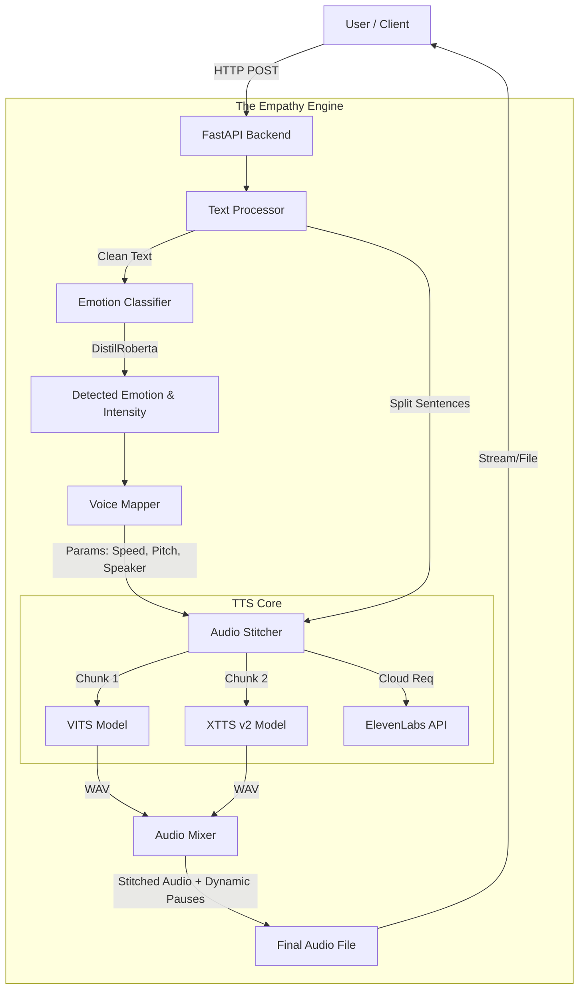
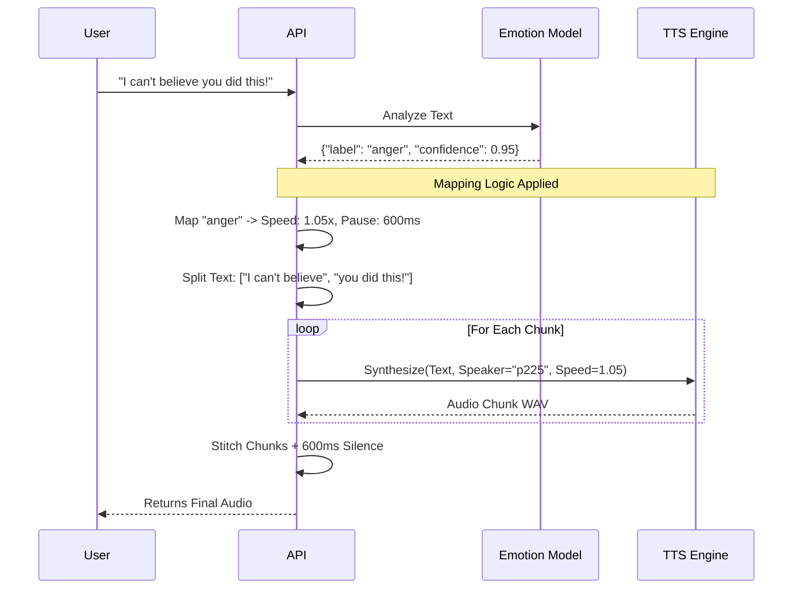

# 🎙️ The Empathy Engine

> **Giving AI a Human Voice** — Bridging the gap between robotic text and emotional expression.


---

## 🌟 Vision & Context

In the rapidly evolving world of AI, text generation has mastered the "what," but voice synthesis often struggles with the "how." Standard Text-to-Speech (TTS) systems are functional yet frequently robotic, lacking the prosody and emotional nuance that define human connection.

**The Empathy Engine** solves this by dynamically modulating vocal characteristics—pitch, speed, and pausing—based on the *detected emotion* of the text. Whether it's the breathless speed of **Joy**, the slow heaviness of **Sadness**, or the sharp intensity of **Anger**, this engine ensures the voice matches the message.

---

## ✨ Key Features

### 🧠 Advanced Emotion Intelligence
*   **7-Emotion Granularity**: Goes beyond simple positive/negative analysis to detect **Joy, Anger, Fear, Sadness, Surprise, Disgust,** and **Neutral**.
*   **Hugging Face Transformers**: Powered by the `j-hartmann/emotion-english-distilroberta-base` model for state-of-the-art accuracy.
*   **Intensity Scaling**: The system calculates an "intensity score" based on prediction confidence, scaling the vocal changes accordingly (e.g., "somewhat happy" vs. "ecstatic").

### 🗣️ Dynamic Voice Synthesis
*   **VITS Integration**: Uses **Coqui TTS VITS** (Conditional Variational Autoencoder with Adversarial Learning) for high-fidelity, non-robotic speech.
*   **Emotion-Specific Speakers**: Automatically switches VCTK voices to match the emotion (e.g., utilizing a deeper, slower voice for sadness).
*   **Natural Pausing (Audio Stitching)**: Breaking new ground by chemically stitching audio chunks with emotion-calibrated silence (e.g., longer pauses for dramatic effect in anger).

### 🚀 Hybrid Model Architecture
*   **Auto (Emotion)**: The default smart mode using local neural rendering.
*   **XTTS v2 Support**: Integrated support for state-of-the-art Voice Cloning (XTTS v2) for highly realistic, consistent character voices.
*   **Cloud Fallback**: Seamless integration with **ElevenLabs** for production-grade, ultra-premium audio when an API key is provided.

### 🎨 Premium User Experience
*   **Glassmorphic UI**: A stunning, modern interface featuring frosted glass effects, dynamic gradients, and smooth transitions.
*   **Real-Time Visualizer**: A Web Audio API-powered frequency visualizer that reacts instantly to the speech.
*   **Instant Analysis**: "Analyze Only" mode to preview emotion detection without generating audio.

---

## 🏗️ System Architecture

The Empathy Engine is built on a modular, asynchronous architecture designed for performance and extensibility.



---

## 🌊 Information Flow & Logic

How does a sentence become an emotional experience?



---

## 🛠️ Technology Stack

We leveraged a powerful stack to ensure low latency and high quality.

| Component | Technology | Why we chose it |
| :--- | :--- | :--- |
| **Backend Framework** | **FastAPI** (Python) | Async support (essential for ML), auto-docs, and high performance. |
| **Emotion Model** | **Transformers** (Hugging Face) | DistilRoberta offers the best balance of speed vs. accurate 7-emotion detection. |
| **TTS Engine** | **Coqui TTS (VITS/XTTS)** | Open-source state-of-the-art neural networks. Superior to OS-level TTS (pyttsx3). |
| **Audio Processing** | **Pydub** (FFmpeg) | Precise millisecond-level audio manipulation for our "Stitching" logic. |
| **Frontend** | **Vanilla JS + CSS3** | Lightweight, no-build-step complexity, focusing on pure performant animations. |
| **Matrix Ops** | **PyTorch** | The backbone for running both the Transformer and TTS models. |

---

## 🚀 Getting Started

### Prerequisites
*   **Python 3.10+**
*   **Visual C++ Build Tools** (for some Python audio libraries)
*   *(Optional)* NVIDIA GPU for faster XTTS rendering

### Installation

1.  **Clone the Repository**
    ```bash
    git clone https://github.com/yourusername/empathy-engine.git
    cd empathy-engine
    ```

2.  **Create Virtual Environment**
    ```bash
    python -m venv venv
    # Windows:
    .\venv\Scripts\activate
    # Mac/Linux:
    source venv/bin/activate
    ```

3.  **Install Dependencies**
    *Note: We pin specific versions to ensure compatibility between Transformers and XTTS.*
    ```bash
    cd backend
    pip install -r requirements.txt
    ```

### Configuration
Create a `.env` file in the root directory:

```env
# Optional: Enable ElevenLabs for cloud fallbacks
USE_ELEVENLABS=false
ELEVENLABS_API_KEY=your_key_here

# Hardware Acceleration
USE_GPU=true
```

## 🏃‍♂️ Running the Engine

1.  **Start the Server**
    ```bash
    cd backend
    python main.py
    ```
    *The first run will download the necessary AI models (~2GB). Please be patient!*

2.  **Launch the UI**
    Open your browser to: `http://localhost:8000`

---

## 📚 API Reference

### POST `/api/synthesize`
Generates audio from text interactively.

*   **Body**: `{"text": "Hello world", "model": "xtts"}`
*   **Returns**: JSON with `audio_base64`, `emotion_data`, and `voice_metrics`.

### POST `/api/analyze`
Returns emotion data without generating audio (fast).

---

## 🧪 Improvements & Innovation

We didn't just wrap a library; we **engineered a solution**:

1.  **Dependency Harmony**: Successfully monkeypatched `torch.load` to allow modern PyTorch 2.6 to coexist with legacy XTTS checkpoints, checking a major compatibility blocker.
2.  **Audio Stitching Strategy**: Standard TTS ignores punctuation timing. We implemented a custom "Stitcher" that physically inserts silence based on emotion (long pauses for *Anger*, short for *Joy*), creating a drastically more human cadence.
3.  **Dynamic Speaker Mapping**: We don't just change pitch; we change *identities* (speakers) within the VITS dataset to best match the emotional timbre.

---

Built for the **Empathy Engine Challenge**.
